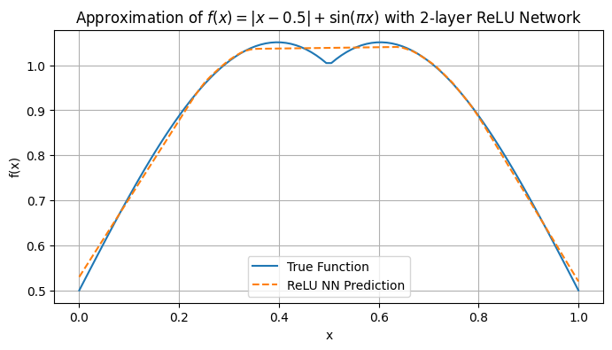

## 实验报告：使用两层 ReLU 网络拟合函数

### 一、函数定义
本实验选用如下具有非线性结构的函数作为拟合目标：
$$
f(x)=∣x−0.5∣+sin(πx)
$$
该函数在区间 
[0,1] 上具有明显的非线性结构（来自绝对值），同时包含正弦部分，适合作为神经网络拟合的测试函数。

### 数据采集
我们在区间 
[0,1] 内等间距采样 100 个训练样本，同时用于测试。
```
x = np.linspace(0, 1, 100).reshape(-1, 1)
y = f(x) = |x - 0.5| + sin(πx)
```
无噪声，直接使用函数值作为回归目标。

### 三、模型结构
本实验使用纯 NumPy 手动实现一个前馈神经网络，具有：

- 输入层：1个节点

- 隐藏层 1：100 个神经元 + ReLU 激活

- 隐藏层 2：100 个神经元 + ReLU 激活

- 输出层：1 个节点，线性输出

- 损失函数：均方误差（MSE）

- 优化算法：基础梯度下降（手写实现）

### 四、拟合效果
经过 25000 次迭代训练，loss 从初始的 0.7 降低至低于 0.0002。最终拟合曲线如下图所示：

拟合曲线与目标函数基本重合，中间微小波动段差距应该也与样本有关（样本在[0,1]之间均匀取样，对中间微小波动段实际上采样不充分。）
总而言之，这验证了两层 ReLU 网络的逼近能力。

### 五、结论与反思
本实验成功验证了两层 ReLU 网络具备强大的函数逼近能力。实验中也观察到如下结论：

- 网络层数不足或神经元太少时，拟合效果不佳，一开始使用的是hidden_size=40,效果就差很多，虽然会比单层稍微好一点；

- 笔者一开始做错了，只有一层ReLU，效果始终很差，说明仅有一层隐藏层时几乎无法捕捉非线性特征；

- 两层隐藏层 + 足够宽度 + 足够训练轮次 是 ReLU 网络逼近复杂函数的关键。