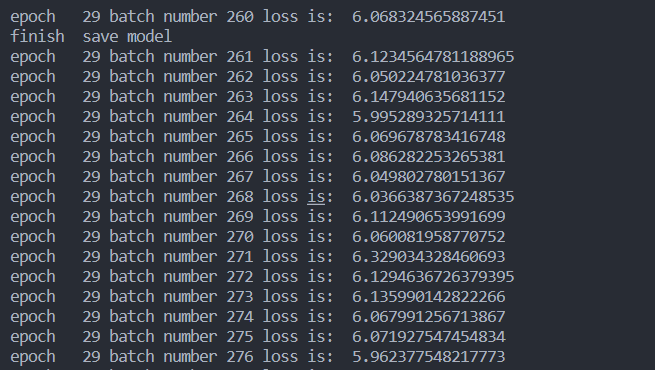

### 2. 解释 RNN、LSTM、GRU 模型
RNN（Recurrent Neural Network） 是一种循环神经网络，主要用于处理序列数据（如文本、时间序列等）。它在每个时间步都会保留上一步的隐藏状态，实现“记忆”的效果。然而，普通 RNN 容易出现梯度消失或梯度爆炸的问题，导致在长序列中难以捕捉长期依赖。

LSTM（Long Short-Term Memory） 是一种改进的 RNN 结构，专为解决长期依赖问题设计。它引入了遗忘门（forget gate）、输入门（input gate）、输出门（output gate），能够选择性地记住或忘记信息，从而在长序列建模中表现更好。

GRU（Gated Recurrent Unit） 是 LSTM 的简化版本，仅使用两个门：更新门（update gate）和重置门（reset gate），同时性能上与 LSTM 相近，但结构更简单、训练更快。

### 3. 诗歌生成的过程
本实验任务是使用循环神经网络（RNN）模型进行诗歌的自动生成。

整个生成流程如下：

词汇编码：将古诗语料中的所有字汇构建词表，并为每个字分配一个唯一索引。

构建模型：使用 PyTorch 实现词向量嵌入（Embedding）层，接上双层 LSTM 层，并通过全连接层输出预测下一个字的概率分布。

训练模型：用已有古诗句子进行训练，输入前 N 个字，预测第 N+1 个字，采用交叉熵损失函数，优化器为 Adam。

生成诗歌：

以给定的“起始词”作为输入。

循环地将当前输入送入模型，预测下一个字，并将其作为新输入继续生成，直到达到设定长度或生成 eos。

可以使用 argmax 策略选择概率最高的词，或采样生成更多样性。

### 4. 使用给定词汇进行生成 + 训练截图
本实验使用“日、红、山、夜、湖、海、月”作为诗歌的开头词，模型能够根据这些词生成相应风格的古诗句。例如：
```
inital  linear weight 
日行春草生，日高风物好。
日光如水水，风物无人行。
error
inital  linear weight 
清风不见千年后，万树千秋不见人。
error
inital  linear weight 
山水下清明，春风生夜深。
寒光不得归，天下有馀声。
error
inital  linear weight 
夜雨声清夜，风光日日长。
不能无处处，不见白头人。
error
inital  linear weight 
不见清风在，无人不见人。
error
inital  linear weight 
不见清风在，无人不见人。
error
inital  linear weight 
不见清风在，无人不见人。
error
inital  linear weight 
不能生人不复贵，不见春风不见春。
```

loss下降过程如下，笔者删去一些不重要的print部分：



### 实验总结
本次实验通过构建双层 LSTM 模型实现古诗生成任务，成功实现了从任意一个起始字出发自动生成风格统一的诗歌句子。通过训练可以观察到模型 loss 稳定下降，说明模型成功学习到了古诗中词与词之间的语言模式。

在使用不同开头词生成时，模型能展现出一定的上下文逻辑和古诗风格，说明 LSTM 对于语言建模和生成任务具有良好的效果。未来可以进一步尝试 Transformer、加大语料训练集、引入押韵规则等手段提升诗歌质量和风格多样性。

